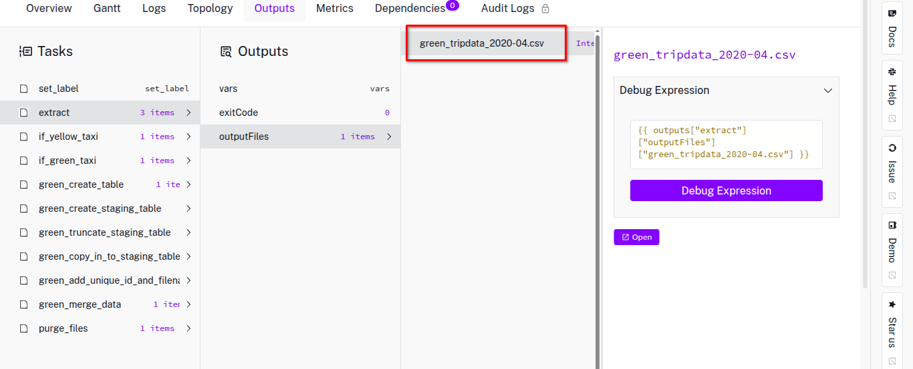

## Question 1

For some reason I do not have preview for a file, so I had to manually find it out.

Inside of the container execute `find . -name "*-yellow_tripdata_2020-12.csv" -exec du -hm {} +`

```bash
root@2d211ddf1a81:/app# find . -name "*-yellow_tripdata_2020-12.csv" -exec du -hm {} +
129     ./storage/main/zoomcamp/04-postgres-taxi/executions/18ZKRQeAM7inJUeOmTj9ti/tasks/extract/5p4VhZY5iAS7bWWxTIuJFP/7FlrQK4pA1X2CbKEHhfN22-yellow_tripdata_2020-12.csv
```

## Question 2



## Question 3

`docker compose exec -T postgres psql -U $(POSTGRES_USER) -d $(POSTGRES_DB) -c "select count(*) from public.yellow_tripdata where filename like 'yellow_tripdata_2020-%"`

<details>
  <summary>Answer</summary> 
    24648499
</details>

## Question 4

`docker compose exec -T postgres psql -U $(POSTGRES_USER) -d $(POSTGRES_DB) -c "select count(*) from public.green_tripdata where filename like 'green_tripdata_2020-%"`

<details>
  <summary>Answer</summary> 
    1734051
</details>

## Question 5

`docker compose exec -T postgres psql -U $(POSTGRES_USER) -d $(POSTGRES_DB) -c "select count(*) from public.yellow_tripdata where filename like 'yellow_tripdata_2021-03_%"`

<details>
  <summary>Answer</summary> 
    1925152
</details>

## Question 6

According to the example in [docs](https://kestra.io/docs/workflow-components/triggers/schedule-trigger):  `timezone: America/New_York`
